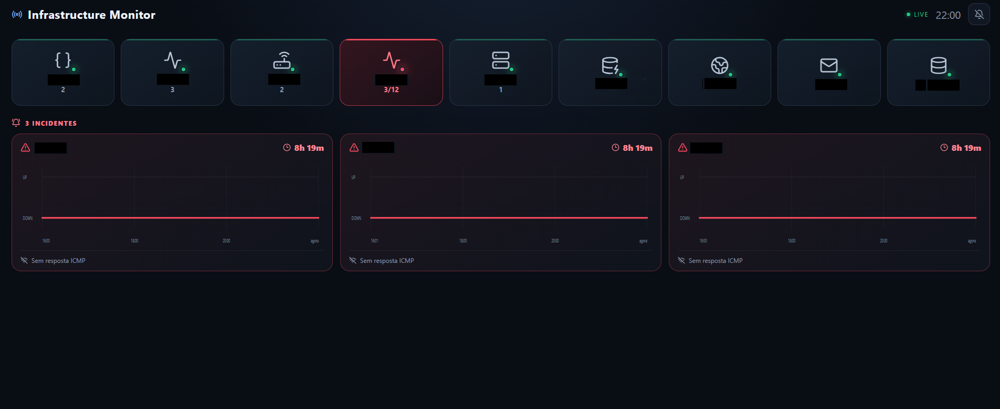

# Uptime-Kuma Wallboard v0.1

Kuma Wallboard is a lightweight, TV-friendly monitoring wallboard for **Uptime Kuma**. It is designed around an exception-first workflow: healthy services are represented by compact badges, while failed monitors receive the visual space, timeline and audio attention they need.

The project can run either with **Docker** or directly with **Node.js** on Windows or Linux.

> Version: **0.1.0**  
> The version is intentionally kept at 0.1.0 while the current feature set is being refined.



## Main features

- Real-time connection to Uptime Kuma through Socket.IO.
- Browser updates through Server-Sent Events (SSE).
- Responsive wallboard layout for landscape and portrait displays.
- Group-aware badges.
- Optional group aggregation.
- Automatic badge rotation when the available space is full.
- Problem badges can remain pinned on screen.
- Automatic icon selection from monitor or group names.
- Custom SVG/PNG/WebP icons.
- Incident cards for failed monitors.
- Availability timeline showing real Uptime Kuma heartbeat states only.
- Audio alerts with mute/unmute toggle.
- Optional automatic audio activation and startup sound test for kiosk/signage players such as Anthias.
- Built-in sounds and custom audio files.
- Include/exclude rules for groups and monitors.
- Custom title and optional logo in the top-left corner.
- Docker and native Node.js execution.

---

# 1. Project structure

```text
kuma-wallboard/
├─ assets/
│  ├─ icons/
│  │  ├─ example-custom.svg
│  │  └─ example-logo.svg
│  └─ sounds/
├─ config/
│  └─ dashboard.json
├─ server/
├─ web/
├─ .env.example
├─ docker-compose.yml
├─ Dockerfile
├─ package.json
└─ README.md
```

The Uptime Kuma credentials are kept in `.env`. Visual and behavioural settings are kept in `config/dashboard.json`.

---

# 2. Requirements

## Native execution

- Node.js 20 or newer. Node.js 24 is recommended.
- npm.
- Network access from the Wallboard server to Uptime Kuma.

## Docker execution

- Docker.
- Docker Compose plugin (`docker compose`).

---

# 3. Environment configuration

Create `.env` from the supplied example.

### Windows

```bat
copy .env.example .env
```

### Linux

```bash
cp .env.example .env
```

Edit `.env`:

```env
WALLBOARD_PORT=3002

KUMA_URL=http://192.168.1.50:3001
KUMA_USERNAME=admin
KUMA_PASSWORD=change-me

MAX_HISTORY=500
```

`WALLBOARD_PORT=3002` is the default because Uptime Kuma commonly runs on port `3001`.

Example:

```text
Uptime Kuma     http://server:3001
Kuma Wallboard  http://server:3002
```

## Authentication

The current project supports username/password authentication through:

```env
KUMA_USERNAME=admin
KUMA_PASSWORD=your-password
```

If a compatible token is configured in your Uptime Kuma setup, the environment file also exposes:

```env
KUMA_TOKEN=
```

When a token is configured, it takes precedence where supported by the client implementation.

---

# 4. Run without Docker

This is fully supported on Windows and Linux.

From the project root:

```bash
npm install
npm run dev
```

This starts both applications:

```text
Frontend development server  http://localhost:5173
Wallboard backend             http://localhost:3002
```

During development, Vite automatically proxies `/api` and `/assets` to the backend.

## Run only the backend

```bash
npm run dev:server
```

## Run only the frontend

```bash
npm run dev:web
```

## Production mode without Docker

```bash
npm install
npm run start:prod
```

`start:prod` performs the frontend/backend build and then starts the backend. The backend serves the compiled frontend from `web/dist`.

The Wallboard is then available at:

```text
http://SERVER_IP:3002
```

or at the port configured with `WALLBOARD_PORT`.

## Build only

```bash
npm run build
```

## Start an already built project

```bash
npm start
```

---

# 5. Run with Docker

Create `.env` first, then run:

```bash
docker compose up -d --build
```

Open:

```text
http://SERVER_IP:3002
```

To use another public port:

```env
WALLBOARD_PORT=3010
```

Then recreate the container:

```bash
docker compose down
docker compose up -d
```

Inside the container the application always listens on port `8080`. Docker maps the configured host port to that internal port.

## View logs

```bash
docker compose logs -f
```

## Stop

```bash
docker compose down
```

---

# 6. API endpoints

The backend exposes a small internal API used by the frontend.

```text
GET /api/health
GET /api/state
GET /api/config
GET /api/events
```

`/api/events` is an SSE endpoint and intentionally keeps the connection open.

A simple health test:

```text
http://localhost:3002/api/health
```

---

# 7. Dashboard configuration

The main visual configuration is:

```text
config/dashboard.json
```

If a setting is omitted, sensible defaults are used.

A minimal configuration can therefore be:

```json
{}
```

With no visibility rules configured, **all groups and all monitors are displayed**.

The Uptime Kuma inventory is synchronized at startup and every five minutes by default. See **Automatic dashboard configuration and inventory synchronization** below for backup and reconciliation behavior.

---

# 8. Title and logo

The title in the top-left corner is fully configurable.

```json
{
  "dashboard": {
    "title": "Production Infrastructure"
  }
}
```

## Add a logo

Place the logo inside `assets`, for example:

```text
assets/icons/company-logo.svg
```

Then configure:

```json
{
  "dashboard": {
    "title": "Production Infrastructure",
    "logo": "/assets/icons/company-logo.svg",
    "logoAlt": "Company logo",
    "logoHeight": 36,
    "showTitle": true
  }
}
```

Supported browser image formats include SVG, PNG, WebP and JPEG. SVG is recommended for TV displays because it scales cleanly at different resolutions.

`logoHeight` is expressed in CSS pixels and is constrained to a safe range by the frontend.

To display only the logo:

```json
{
  "dashboard": {
    "logo": "/assets/icons/company-logo.svg",
    "showTitle": false
  }
}
```

If no logo is configured, the default Wallboard icon is shown next to the title.

---

# 9. Dashboard options

Example:

```json
{
  "dashboard": {
    "title": "Infrastructure Monitor",
    "logo": "",
    "logoAlt": "Infrastructure Monitor",
    "logoHeight": 34,
    "showTitle": true,
    "theme": "dark",
    "orientation": "auto",
    "showClock": true,
    "recoverDisplaySeconds": 30
  }
}
```

## Orientation

Supported values:

```text
auto
landscape
portrait
```

`auto` is recommended. The Wallboard adapts automatically to horizontal and vertical TVs.

---

# 10. Badges

Badges represent either individual monitors or aggregated groups.

Example:

```json
{
  "badges": {
    "display": "icon_text",
    "pinProblems": true,
    "problemBehavior": "pin",
    "rotation": {
      "enabled": true,
      "intervalSeconds": 8,
      "pauseOnCritical": false,
      "transition": "fade"
    }
  }
}
```

Badge states are communicated by colour. The Wallboard deliberately does **not** add `OK` or `NOK` text to every badge.

## Display modes

```text
icon_only
text_only
icon_text
count
```

`count` is most useful for aggregated groups.

---

# 11. Badge rows and automatic rotation

You can explicitly define how many badge rows are available:

```json
{
  "badges": {
    "rows": 3
  }
}
```

You may also use orientation-specific values:

```json
{
  "badges": {
    "rowsLandscape": 2,
    "rowsPortrait": 4
  }
}
```

## Default behaviour

If `rows`, `rowsLandscape` and `rowsPortrait` are all omitted:

1. The Wallboard first tries to display the badges in one row.
2. If they do not fit, it automatically expands to two rows.
3. Only after the two-row capacity is exceeded does badge rotation begin.

Problem badges can remain visible while healthy badges rotate.

---

# 12. Automatic icon selection

An icon does not have to be configured manually.

When `icon` is missing, the Wallboard analyses the group name, monitor name and monitor type and attempts to choose a suitable icon.

Examples of recognised concepts include:

```text
server / servidor
windows
linux
api
web / website / http
internet / wan
router
gateway
switch
wifi / wireless
firewall
vpn
database / db
sql
postgres
mysql
oracle
nas
storage
backup
mail / smtp
DNS
docker
vm / virtual machine
vmware / esxi
printer
camera
ups
power
cloud
```

An explicitly configured icon always has priority over automatic detection.

Example:

```json
{
  "monitors": {
    "Core Router": {
      "icon": "router"
    }
  }
}
```

---

# 13. Custom icons

Custom images can be used as badge icons.

Place the image in:

```text
assets/icons/
```

Example:

```text
assets/icons/sap.svg
```

Then configure:

```json
{
  "monitors": {
    "SAP Production": {
      "icon": "/assets/icons/sap.svg"
    }
  }
}
```

SVG is recommended.

---

# 14. Groups and aggregation

By default, monitors that belong to a Uptime Kuma group are **aggregated into a single group badge**. Monitors that are not assigned to a group continue to appear individually.

```json
{
  "groups": {
    "ERP": {
      "aggregate": true
    }
  }
}
```

To show every monitor in a specific group as an individual badge, explicitly disable aggregation:

```json
{
  "groups": {
    "ERP": {
      "aggregate": false,
      "label": "ERP",
      "icon": "database"
    }
  }
}
```

When an aggregated group contains a failed monitor, the group badge changes to the problem colour. Incident cards are still shown per failed monitor so the exact equipment can be identified.

Different groups may use different aggregation settings. An explicit `aggregate: false` always overrides the default and shows that group's monitors individually.

---

# 15. Group configuration

Example:

```json
{
  "groups": {
    "NETWORK": {
      "label": "Network",
      "icon": "network",
      "display": "icon_text",
      "priority": 90,
      "sound": "critical",
      "aggregate": true
    }
  }
}
```

Useful group options include:

```text
label
icon
display
priority
sound
aggregate
visible
hidden
monitorIcon
monitorDisplay
```

When a group is not aggregated, `monitorIcon` and `monitorDisplay` can provide defaults for its individual monitor badges.

---

# 16. Monitor configuration

Example:

```json
{
  "monitors": {
    "ERP API": {
      "label": "ERP API",
      "icon": "api",
      "priority": "critical",
      "showGraphOnFailure": true,
      "graphType": "availability",
      "alertAfterSeconds": 10
    }
  }
}
```

Possible monitor options include:

```text
label
icon
display
visible
hidden
showIncident
showGraphOnFailure
graphType
sound
priority
alertAfterSeconds
```

---

# 17. Visibility filters

If no visibility configuration exists, everything is shown.

The global filter supports:

```text
all
include
exclude
```

## Exclude selected groups

```json
{
  "visibility": {
    "groups": {
      "mode": "exclude",
      "items": ["TEST", "DEVELOPMENT"]
    }
  }
}
```

## Show only selected groups

```json
{
  "visibility": {
    "groups": {
      "mode": "include",
      "items": ["ERP", "NETWORK", "SERVERS"]
    }
  }
}
```

## Exclude selected monitors

```json
{
  "visibility": {
    "monitors": {
      "mode": "exclude",
      "items": ["Google Test", "Old Router"]
    }
  }
}
```

A monitor hidden by these rules is ignored by the Wallboard. It does not affect visible group counters and does not generate Wallboard audio alerts.

---

# 18. Per-group and per-monitor visibility

You can also hide individual items directly:

```json
{
  "groups": {
    "TEST": {
      "visible": false
    }
  },
  "monitors": {
    "Temporary Monitor": {
      "visible": false
    }
  }
}
```

`hidden: true` is also accepted for backwards compatibility.

## Show the monitor in the badge but hide the incident card

```json
{
  "monitors": {
    "Backup Server": {
      "showIncident": false
    }
  }
}
```

The monitor still affects the group state but no incident chart/card is displayed.

---

# 19. Incidents and charts

Incident cards are displayed only for failed monitors that are visible and have `showIncident` enabled.

Example:

```json
{
  "incidents": {
    "maxVisible": 6,
    "rotateEverySeconds": 10,
    "graphWindowMinutes": 360,
    "showMessage": true
  }
}
```

## Availability chart

The current incident chart is intentionally focused on availability:

```text
UP
DOWN
```

It uses real Uptime Kuma heartbeat values only.

The frontend does not invent an `UP` point to make a transition look nicer. If a monitor is currently DOWN, the right edge of the chart is forced to the real current DOWN state so the chart cannot misleadingly end as UP.

The chart automatically extends to the current time while the outage remains active.

---

# 20. Incident messages

Uptime Kuma may return long technical output, especially for ping checks. The Wallboard converts common messages into compact labels such as:

```text
No ICMP response
Timeout
Host unreachable
DNS error
Connection refused
SSL/TLS error
```

The original message remains available as the element tooltip/title where supported by the browser.

---

# 21. Audio alerts

Audio is controlled from the single speaker toggle in the top-right corner.

The Wallboard can also try to enable audio automatically when it starts. This is useful for unattended TV/signage installations such as Anthias:

```json
{
  "audio": {
    "enabledByDefault": true,
    "testOnStartup": true,
    "startupVolume": 0.15
  }
}
```

- `enabledByDefault`: attempts to activate audio as soon as the Wallboard configuration is loaded. Default: `true`.
- `testOnStartup`: plays one short recovery-style test sound after successful automatic audio activation. Default: `true`.
- `startupVolume`: volume used only for the startup test sound, from `0` to `1`. Default: `0.15`.

When `config/dashboard.json` does not exist and is generated from the Uptime Kuma inventory, the `audio` block above is written explicitly to the new file.

If the display engine blocks autoplay, the Wallboard logs a warning in the browser console and the speaker remains muted. The website cannot override a browser/WebView autoplay policy.

## Anthias

For Anthias deployments, a useful first test is:

```json
{
  "audio": {
    "enabledByDefault": true,
    "testOnStartup": true,
    "startupVolume": 0.2
  }
}
```

Reload the asset in Anthias. If you hear the short startup sound, unattended incident audio should also be able to play. If no sound is heard, check the Anthias device output/mixer and the WebView autoplay behaviour.

```text
Speaker enabled  -> alerts can play
Speaker muted    -> no alert sound
```

There is no second audio activation button elsewhere on the page.

In ordinary browsers, autoplay restrictions may still require a user click. On unattended signage players the Wallboard now attempts automatic activation first; whether this succeeds depends on the player/WebView autoplay policy.

## Alert configuration

```json
{
  "alert": {
    "enabled": true,
    "defaultSound": "critical",
    "volume": 0.75,
    "repeatAfterSeconds": 300,
    "maxRepeats": 3,
    "alertAfterSeconds": 10,
    "recoverySound": "recovery"
  }
}
```

`alertAfterSeconds` can prevent short transient failures from immediately triggering sound.

---

# 22. Built-in sounds

The default configuration includes:

```json
{
  "sounds": {
    "critical": "builtin:critical",
    "warning": "builtin:warning",
    "recovery": "builtin:recovery"
  }
}
```

---

# 23. Custom sounds

Place audio files inside:

```text
assets/sounds/
```

For example:

```text
assets/sounds/network-down.mp3
```

Configure:

```json
{
  "sounds": {
    "network-down": "/assets/sounds/network-down.mp3"
  },
  "groups": {
    "NETWORK": {
      "sound": "network-down"
    }
  }
}
```

Common browser-supported formats include MP3, WAV and OGG.

## Disable sound for one monitor

```json
{
  "monitors": {
    "Non Critical Monitor": {
      "sound": false
    }
  }
}
```

## Disable sound for an entire group

```json
{
  "groups": {
    "TEST": {
      "sound": false
    }
  }
}
```

Visual alerts still remain active.

---

# 24. Example configuration

```json
{
  "dashboard": {
    "title": "Production Systems",
    "logo": "/assets/icons/company-logo.svg",
    "logoAlt": "Company",
    "logoHeight": 36,
    "showTitle": true,
    "orientation": "auto",
    "showClock": true
  },
  "badges": {
    "display": "icon_text",
    "pinProblems": true,
    "rotation": {
      "enabled": true,
      "intervalSeconds": 8
    }
  },
  "visibility": {
    "groups": {
      "mode": "all",
      "items": []
    },
    "monitors": {
      "mode": "all",
      "items": []
    }
  },
  "groups": {
    "ERP": {
      "aggregate": true,
      "icon": "database"
    },
    "NETWORK": {
      "aggregate": false
    }
  },
  "monitors": {
    "ERP API": {
      "showGraphOnFailure": true,
      "sound": "critical"
    }
  }
}
```

---

# 25. Configuration precedence

The Wallboard follows these general rules:

1. Explicit monitor configuration has priority for monitor-specific presentation.
2. Group monitor defaults may be applied to individual monitors.
3. Global badge defaults are used when nothing more specific exists.
4. An explicit icon always overrides automatic icon detection.
5. `visible: false` hides an item completely from the Wallboard.
6. `showIncident: false` keeps the badge/state but hides the incident card.
7. `sound: false` keeps the visual state but suppresses audio for that item.
8. With no visibility filters configured, all Uptime Kuma groups and monitors are shown.

---

# 26. Uptime Kuma connection model

Kuma Wallboard uses Uptime Kuma's internal Socket.IO events to receive data such as monitor lists and heartbeats in real time.

The integration is isolated in:

```text
server/src/kumaClient.ts
```

This is intentional because Uptime Kuma's internal API is not guaranteed to remain stable across all future releases. If Uptime Kuma changes its internal event structure, the compatibility adjustment should normally be limited to this layer and the state normalisation code.

---

# 27. Troubleshooting

## `KUMA_URL is required`

Confirm that `.env` exists in the project root and contains:

```env
KUMA_URL=http://SERVER:3001
```

The native Node.js mode loads the root `.env` automatically.

## `/api/events` returns 404 during development

Make sure you are using the supplied `web/vite.config.ts` and start both applications with:

```bash
npm run dev
```

Vite proxies `/api` and `/assets` to the Wallboard backend.

## `web/dist` not found

This message is expected when running the development servers before a production build exists.

For production mode use:

```bash
npm run start:prod
```

## The Wallboard cannot connect to Kuma

Check:

```text
KUMA_URL
KUMA_USERNAME
KUMA_PASSWORD
```

Then verify that the Wallboard machine can open the Uptime Kuma URL directly.

## Audio does not play

1. Set `audio.enabledByDefault` to `true`.
2. Temporarily set `audio.testOnStartup` to `true`.
3. Reload the Wallboard asset.
4. Check the browser/WebView console for `[AUDIO]` messages.
5. Verify that the TV/player operating system has the correct audio output selected and is not muted.

If autoplay is blocked by the browser/WebView, use the top-right speaker toggle when interaction is available. A web page cannot force sound when the host rendering engine explicitly blocks autoplay.

## Custom image does not appear

If the file is:

```text
assets/icons/logo.svg
```

use:

```json
"logo": "/assets/icons/logo.svg"
```

or for a badge:

```json
"icon": "/assets/icons/logo.svg"
```

---

# 28. Security notes

- Do not commit `.env` to source control.
- Keep Uptime Kuma credentials outside `dashboard.json`.
- The supplied `.gitignore` excludes `.env`.
- If the Wallboard is exposed outside a trusted network, place it behind an HTTPS reverse proxy and appropriate access controls.
- The Wallboard needs read access to Uptime Kuma monitoring state; avoid using broader credentials than necessary.

---

# 29. Updating configuration

After editing `config/dashboard.json`, restart the application to guarantee the new configuration is loaded.

Native mode:

```bash
Ctrl+C
npm run dev
```

Docker:

```bash
docker compose restart
```

---

# 30. Current design principle

Kuma Wallboard is intentionally exception-oriented:

- Healthy infrastructure should remain visually quiet.
- Problems should become immediately obvious.
- Audio should attract attention but remain controllable.
- Large monitoring estates should use compact badges and rotation rather than dense text.
- Failed devices receive detailed incident cards and history only when attention is needed.

## Automatic dashboard configuration and inventory synchronization

If `config/dashboard.json` does not exist, Kuma Wallboard starts with safe in-memory defaults, connects to Uptime Kuma, requests the monitor inventory and creates:

```text
<project-root>/config/dashboard.json
```

The generated file contains all discovered Uptime Kuma groups and monitors, keeps everything visible by default, uses `aggregate: true` for discovered groups, and suggests icons from group/monitor names and monitor types. Paused monitors are kept in the configuration as well, so temporarily disabling a monitor in Kuma does not remove its customization.

Inventory synchronization always runs once at application startup. By default, Kuma Wallboard then requests a fresh monitor list from Uptime Kuma every five minutes. Configure this in `dashboard.json`:

```json
{
  "sync": {
    "enabled": true,
    "intervalMinutes": 5,
    "recreateDashboard": true,
    "backup": true
  }
}
```

`enabled: false` disables periodic inventory refreshes, but the startup inventory request still runs. `intervalMinutes` is clamped to a safe range of 1 to 1440 minutes.

`recreateDashboard` controls whether an **existing** `dashboard.json` may be reconciled and rewritten automatically when the Uptime Kuma inventory changes:

- `true` (default): inventory changes are persisted to a newly written `dashboard.json`.
- `false`: an existing `dashboard.json` is never rewritten automatically. New/deleted groups and monitors can still exist in the live Uptime Kuma state, but the persistent JSON file remains untouched.
- If `dashboard.json` does **not** exist, it is always created from the Uptime Kuma inventory, even when `recreateDashboard` would otherwise be `false`. This guarantees that a missing configuration can always bootstrap itself.

When `recreateDashboard` is enabled and the Uptime Kuma inventory changes, Kuma Wallboard reconciles the file rather than discarding its custom settings:

- Existing group and monitor configuration objects are preserved exactly, including `aggregate`, `icon`, `label`, `display`, `sound`, visibility rules and incident options.
- New Uptime Kuma groups and monitors are added with default values and automatically inferred icons.
- Groups and monitors deleted from Uptime Kuma are removed from the new `dashboard.json`.
- Unrelated top-level settings are preserved.
- If the inventory has not changed, the configuration file is not rewritten and no backup is created.

Before a changed configuration is written, the previous `dashboard.json` is renamed in the same directory. For example:

```text
config/dashboard.20260921-232500.bak.json
config/dashboard.json
```

The newly created `dashboard.json` contains the reconciled configuration. If writing the new file fails, Kuma Wallboard attempts to restore the previous file from the backup. Set `"backup": false` only if you explicitly do not want these inventory-change backups.

If the existing `dashboard.json` contains invalid JSON, synchronization is skipped and the file is never replaced automatically.

### Native Windows path handling

Docker uses `/app/config/dashboard.json` inside the container. That Docker path must never be used for a native Windows execution. Kuma Wallboard detects this case and ignores Docker-only `/app/...` paths when running natively on Windows.

For example, when the project is located at:

```text
C:\tmartins\nodejs\wallboard-uptime
```

the automatically generated configuration is:

```text
C:\tmartins\nodejs\wallboard-uptime\config\dashboard.json
```

not `C:\app\config\dashboard.json`.

If `DASHBOARD_CONFIG` is set to a relative path, it is always resolved from the project root. Absolute custom paths remain supported.

### Ungrouped monitors

Monitors that do not belong to an Uptime Kuma group are **never placed into a synthetic group** such as `Others` or `Outros`. They are always rendered as individual badges. Only real groups received from Uptime Kuma can be aggregated.

### Existing outages at Wallboard startup

When the Wallboard starts while a monitor is already DOWN, it uses Uptime Kuma's `importantHeartbeatList` state-transition history to recover the real start of the current outage. The displayed `DOWN for` duration therefore starts at the original UP → DOWN transition instead of at the moment the Wallboard process/browser was opened.

If the Kuma instance does not provide important heartbeat history for a monitor, the Wallboard falls back to the oldest DOWN heartbeat available in the normal heartbeat history.
